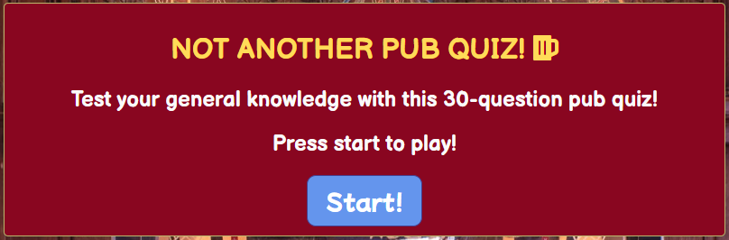

# Not Another Pub Quiz
Link to the live project here: https://carwynteifion.github.io/Milestone-Project-2-IFD/

Not Another Pub Quiz is a website designed to entertain the user with a quiz game. The questions are general knowledge and of varying difficulty so as to make the quiz as accessible as possible, while still remaining challenging to even the most hardened trivia buff.

<h2 align="center"></h2>

# Table of Contents
1. [User Experience](#user-experience)
  - [User Stories](#user-stories)
  - [Design](#design)
  - [Wireframes](#wireframes)

2. [Features](#features)

3. [Technologies Used](#technologies-used)
  - [Languages Used](#languages-used)
  - [Frameworks, Libraries and Programs Used](#frameworks-libraries-and-programs-used)

4. [Testing](testing)
  - [HTML, CSS and JavaScript Validation](#html-css-and-javascript-validation)
  - [Testing User Stories from UX Section](#testing-user-stories-from-ux-section)
  - [Further Testing](#further-testing)
  - [Known Bugs](#known-bugs)
  - [Fixed Bugs](#fixed-bugs)

5. [Deployment](#deployment)
  - [GitHub Pages](#github-pages)
  - [Forking the GitHub Repository](#forking-the-github-repository)
  - [Making a Local Clone](#making-a-local-clone)

6. [Credits](#credits)
  - [Code](#code)
  - [Content](#content)
  - [Media](#media)
  - [Acknowledgements](#acknowledgements)


## User Experience
- User stories
  - First Time Visitor Goals
    - a. As a first-time user, I want to establish the nature of the site and explore its contents.
    - b. As a first-time user, I want to play the quiz and receive instant feedback on my progress.
    - c. As a first-time user, I want to restart the quiz easily after I have played it through.
  - Returning Visitor Goals
    - a. As a returning user, I want to see if the quiz presents any new challenges.
  - Frequent Visitor Goals
    - a. As a frequent visitor, I want to see my high score so I can compare to how I am currently doing.

- Design
  - Colour Scheme
    - The colour scheme includes burgundy, mustard yellow and olive green, with off-white text. This links well to the colours in the pub background and ties in to the rustic theme. The buttons are a neutral cornflower blue to stand out from the underlying theme colours, and change colour to red or green depending on correct or incorrect answers being revealed.
  - Typography
    - The fonts chosen are Balsamiq Sans for the headers, questions and score counters, and Mochiy Pop P One for the quiz button elements. Balsamiq Sans is ideal for conveying information about the site to the user while also giving a fun stylistic effect, while Mochiy Pop P One is a little bolder and more wacky to lean in to the quiz theme. Sans serif is used as a backup for both.
  - Imagery
    - As it is a pub quiz, the background image of a pub bar is thematically consistent.

- Wireframes
  - Title - [Desktop](/assets/wireframes/Title-Desktop.png), [Mobile](/assets/wireframes/Title-Mobile.png), [Tablet](/assets/wireframes/Title-Tablet.png)
  - Quiz - [Desktop](/assets/wireframes/Quiz-Desktop.png), [Mobile](/assets/wireframes/Quiz-Mobile.png), [Tablet](/assets/wireframes/Quiz-Tablet.png)

## Features
- Responsive on mobile, tablet and desktop sizes
- Interactive elements

## Technologies Used
### Languages Used
- HTML5
- CSS3
- JavaScript

### Frameworks, Libraries and Programs used
1. [Balsamiq Wireframes](https://balsamiq.com/wireframes/) - used in the design process to draw the site's wireframes.
2. [Google Fonts](https://fonts.google.com/) - used to import the Mochiy Pop P One and Balsamiq Sans fonts.
3. [Font Awesome](https://fontawesome.com/) - used to add an icon to the page to improve UX.
4. [Git](https://gitpod.io/) - used for version control via Gitpod. The terminal was used to commit and push code to GitHub.
5. [GitHub](https://www.github.com/) - used to store the project's pushed code from Git.

## Testing

### HTML, CSS and JavaScript Validation
The W3C Markup and CSS Validators, and JSHint JavaScript Validator were used to validate each page to ensure the project was free from errors.

- [W3C Markup Validator Results](https://validator.w3.org/nu/?doc=https%3A%2F%2Fcarwynteifion.github.io%2FMilestone-Project-2-IFD%2F)
- [W3C CSS Validator Results](https://jigsaw.w3.org/css-validator/validator?uri=https%3A%2F%2Fcarwynteifion.github.io%2FMilestone-Project-2-IFD%2F&profile=css3svg&usermedium=all&warning=1&vextwarning=&lang=en)
- JSHint JavaScript Validator returned no errors, and the following metrics:
  - There are 11 functions in this file.
  - Function with the largest signature take 2 arguments, while the median is 1.
  - Largest function has 14 statements in it, while the median is 2.
  - The most complex function has a cyclomatic complexity value of 4 while the median is 1.

### Testing User Stories from UX Section

- First Time Visitor Goals
  - a. As a first-time user, I want to establish the nature of the site and explore its contents.
    - i. The site's title and subheading establishes its purpose as a pub quiz app, as well as informing the user of the number of questions.
    - ii. The invitation to press start, as well as the large "Start!" call to action button, directs the user in how to initiate the quiz.
  <h2 align="center"></h2>
    - iii. The background image is of a pub bar, again communicating to the user the purpose of the site as a pub quiz app.

  - b. As a first-time user, I want to play the quiz and receive instant feedback on my progress.
    - i. The user can click the Start button to initiate the quiz, and is then presented with a randomly-chosen question from the question array.
    - ii. Upon selecting an answer, the quiz reveals to the user which answer was correct and which were incorrect, using a change in background colour of the buttons to either green or red to indicate correct or incorrect respectively.
    - iii. The score counter increments if the answer was correct and also displays how many questions have been answered correctly out of the total number answered so far.
    - iv. After taking time to assess which answer was correct and which were incorrect, the user can then click the Next button which appears after an answer is selected. This presents a new randomly-chosen question.
    - v. This process repeats until the number of questions in the randomised array equals the number of the question last answered. The user is presented with a final score, the high score is updated if it is lower than the current score, and the user may restart the quiz using the restart button.
  - c. As a first-time user, I want to restart the quiz easily after I have played it through.
    - i. The restart button appears after the last question in the array is answered, allowing the user to try again for a better score.
- Returning Visitor Goals
  - a. As a returning user, I want to see if the quiz presents any new challenges.
    - i. While the questions are the same each time, they are presented to the user at random. The user is likely to expect the same order but will be thrown off when the questions are presented in a new order.
- Frequent Visitor Goals
  - a. As a frequent visitor, I want to see my high score so I can compare to how I am currently doing.
    - i. The high score is updated at the end of each quiz round if the current score is higher than the high score's current value. The user can review the high score while taking the quiz at any time.


### Further Testing
The site has been tested on Chrome, Edge, Firefox and DuckDuckGo on mobile, desktop and tablet devices of varying screen widths.

Scripts work as expected and without any known issues.

Family also assisted in testing the site, and reported no major issues.

### Known Bugs
- No currently known bugs.
### Fixed Bugs
- Score counter now implemented. This was done by adding the incrementer to the setStatusClass function.
- Score counter no longer increments more than once. This was done by removing a second call of the function setStatusClass, which itself was left redundant after replacing changing background colours with a static image in the CSS.
- Score counter now increments only when a correct answer is selected. This was fixed by moving the incrementer out of the forEach on line 74 and into its own if(correct) function.
- Font Awesome icon was made visible by moving font styling from * to body.
## Deployment

### GitHub Pages

The project was deployed to GitHub Pages using the following steps...

1. Log in to GitHub and locate the [GitHub Repository](https://github.com/carwynteifion/Milestone-Project-2-IFD)
2. At the top of the Repository (not top of page), locate the "Settings" Button on the menu.
3. Scroll down the Settings page until you locate the "GitHub Pages" Section.
4. Under "Source", click the dropdown called "None" and select "Main Branch".
5. The page will automatically refresh.
6. Scroll back down through the page to locate the now published site [link](https://carwynteifion.github.io/Milestone-Project-2-IFD/) in the "GitHub Pages" section.

### Forking the GitHub Repository

By forking the GitHub Repository we make a copy of the original repository on our GitHub account to view and/or make changes without affecting the original repository by using the following steps...

1. Log in to GitHub and locate the [GitHub Repository](https://github.com/carwynteifion/Milestone-Project-2-IFD)
2. At the top of the Repository (not top of page) just above the "Settings" Button on the menu, locate the "Fork" Button.
3. You should now have a copy of the original repository in your GitHub account.

### Making a Local Clone

1. Log in to GitHub and locate the [GitHub Repository](https://github.com/carwynteifion/Milestone-Project-2-IFD)
2. Under the repository name, click "Clone or download".
3. To clone the repository using HTTPS, under "Clone with HTTPS", copy the link.
4. Open Git Bash
5. Change the current working directory to the location where you want the cloned directory to be made.
6. Type `git clone`, and then paste the URL you copied in Step 3.

```
$ git clone https://github.com/YOUR-USERNAME/YOUR-REPOSITORY
```

7. Press Enter. Your local clone will be created.

```
$ git clone https://github.com/YOUR-USERNAME/YOUR-REPOSITORY
> Cloning into `Milestone-Project-2-IFD-Clone`...
> remote: Counting objects: 10, done.
> remote: Compressing objects: 100% (8/8), done.
> remove: Total 10 (delta 1), reused 10 (delta 1)
> Unpacking objects: 100% (10/10), done.
```

Click [Here](https://help.github.com/en/github/creating-cloning-and-archiving-repositories/cloning-a-repository#cloning-a-repository-to-github-desktop) to retrieve pictures for some of the buttons and more detailed explanations of the above process.

## Credits

### Code

### Content

All code was written by the developer.

### Media

- Background image from https://wallpapersafari.com/w/mFlzca
- Favicon from https://favicon.io/emoji-favicons/beer-mug/

### Acknowledgements

- My mentor, Chris, for giving the best encouragement and feedback as always.
- Ed and Sean from Tutor Support for guidance on building my score counter.
- My fiancée, Isadora, for UX/bug testing this site.
[Back to top](#not-another-pub-quiz)